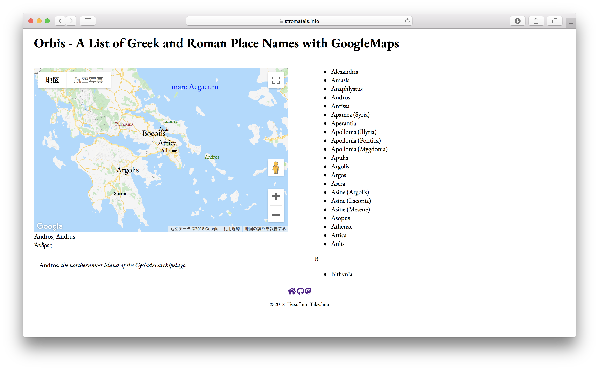

# Orbis

## What is this?
A List of Greek and Roman Place Names with GoogleMaps.

## Usage
Set your API key into `YOUR_API_KEY` of `index.html`.

[Available](https://stromateis.info/orbis/index.html) on my website.

## Contact
[Website](https://www.stromateis.info) [Github](https://github.com/ncrt035) [Mastodon](https://gnosia.info/@ncrt035) [Twitter](https://twitter.com/ncrt035) (not active)

## License
MIT License: Copyright © Tetsufumi Takeshita.
